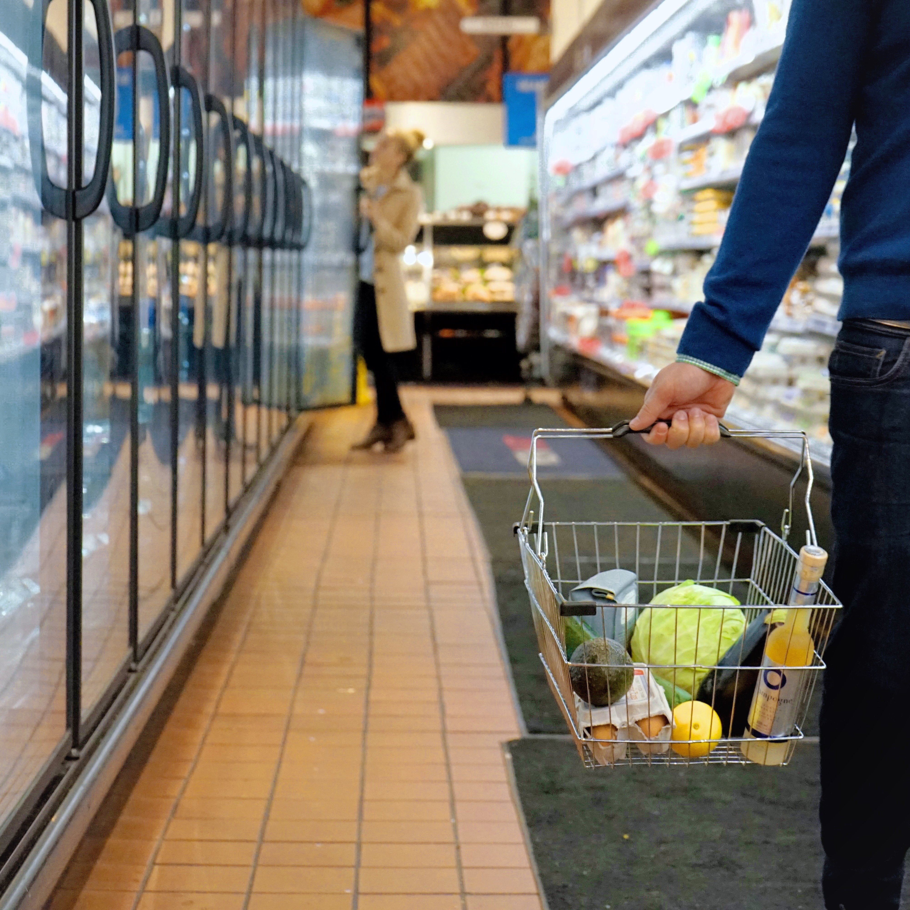

In this project I used the K-means algorithm to cluster grocery items based on their transaction data.

**Items that are often purchases together can be placed in the same aisle or aisles closer to each other,
increasing sales!**

This used to be done by human experts, which would require **many years of experience** in the industry to
narrow things down. However, with the rise of big data and machine learning, why not
let AI do all the trick and hard work for you?

